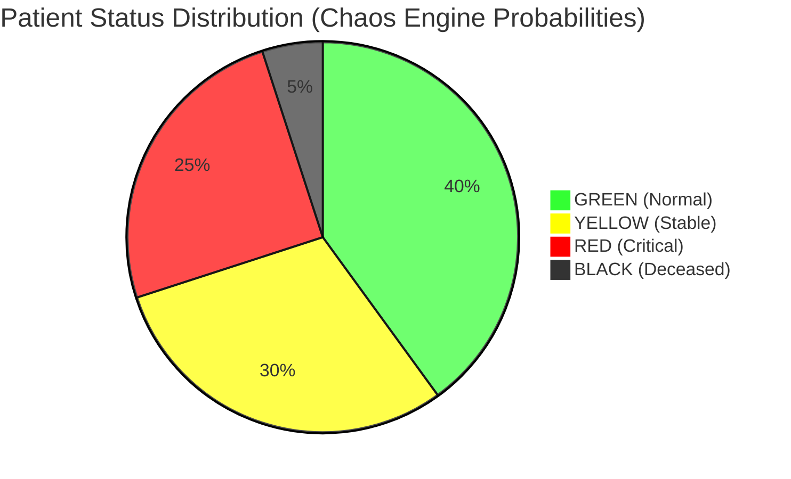

# 🧬 AESCULAPIUS: OMEGA PROTOCOL


```
╔═══════════════════════════════════════════════════════════════╗
║  ▄▀█ █▀▀ █▀ █▀▀ █░█ █░░ ▄▀█ █▀█ █ █░█ █▀                      ║
║  █▀█ ██▄ ▄█ █▄▄ █▄█ █▄▄ █▀█ █▀▀ █ █▄█ ▄█                      ║
║                                                               ║
║              [OMEGA PROTOCOL INITIALIZED]                     ║
║           > TRIAGE SYSTEM v2.0 :: ACTIVE <                    ║
╚═══════════════════════════════════════════════════════════════╝
```

> *"In the space between heartbeat and flatline, the machine makes its judgment."*

---

## 🩺 WHAT IS THIS?

Picture this: It's 3 AM in an underground facility. The phosphor-green glow of a CRT monitor casts eerie shadows across your face. Outside, sirens wail. Inside, a relentless stream of data floods your terminal—names, vital signs, diagnoses. Some will live. Others won't. **You** are the last line of defense in a collapsing world.

**AESCULAPIUS** isn't just a medical triage system. It's a dystopian thought experiment wrapped in retro-futuristic aesthetics—a simulation where human lives become database entries, and survival is calculated by cold, unfeeling algorithms. Inspired by the narrative dread of *Resident Evil*, the clinical horror of *SCP Foundation*, and the visual brutality of 80s terminal interfaces, this project asks one uncomfortable question: *What happens when machines decide who deserves to live?*

---

## 💀 PHILOSOPHY & IDEOLOGY

### The Aesthetics of Desperation

The visual language speaks before the code even runs. That sickly green terminal font isn't nostalgia—it's **menace**. The scanlines flickering across your screen, the blood dripping down the edges, the clinical color-coding of human suffering (RED, YELLOW, GREEN, BLACK)—every pixel reinforces the same message: hope is a luxury you can't afford here.

This is cyberpunk stripped of its neon glamour. No flying cars, no chrome cityscapes—just you, a dying database, and the crushing weight of impossible choices. The interface deliberately feels **soulless** because it mirrors the system's purpose: reduce chaos to data, humans to statistics, tragedy to manageable rows in a table.

### Chaos as a System

At the heart of AESCULAPIUS lies the **Chaos Engine**—a philosophical paradox disguised as Python code. It's an algorithmic representation of catastrophe: random, merciless, yet strangely ordered. The engine doesn't care about your feelings. It generates patients with randomized vitals, assigns them color-coded death sentences based on probability distributions, and streams them into your terminal like a conveyor belt in a nightmare factory.

And here's the twist: *you can't save everyone*. The system forces you into the moral calculus of triage. Who gets the doctor? Who gets the room? Who gets crossed off as BLACK—deceased, decomposed, done? The Chaos Engine doesn't just simulate a crisis; it makes you **complicit** in it.

---

## 🏗️ TECHNICAL ARCHITECTURE

### The Stack

AESCULAPIUS runs on a surprisingly simple but brutally efficient tech foundation:

- **Python 3.x** powers the backend—threading, database connections, and the dreaded Chaos Engine itself
- **Flask** serves the web interface and exposes the API endpoints that feed data to your terminal
- **Microsoft SQL Server** stores the entire catastrophe: patient records, threat classifications, doctor assignments, room allocations
- **pyodbc** acts as the bridge between Python and the database
- **Vanilla JavaScript** handles the frontend—no frameworks, no dependencies, just raw Fetch API calls polling the server every second for fresh horror
- **CSS3** recreates the CRT aesthetic with scanlines, vignette effects, text glow, and dripping blood animations

### How It Actually Works

When you fire up `app.py`, something sinister happens behind the scenes. The Flask server initializes, but simultaneously—through Python's threading module—a separate background thread spawns and begins executing the Chaos Engine. This is crucial: while you're interacting with the interface, the engine runs **independently**, continuously generating new patients and injecting them into the database. The simulation never stops, never sleeps, never gives you a moment to breathe.

#### The Chaos Engine Logic

The engine operates on a probability-weighted system that feels disturbingly realistic:

- **5% of patients arrive already dead** (BLACK status)—heart rate zero, oxygen saturation zero, assigned to "Biological Decomposition" as a threat
- **25% are critical** (RED)—hearts racing beyond 140 BPM, oxygen levels plummeting below 85%, clinging to life
- **30% are stable but serious** (YELLOW)—elevated vitals, fractures, infections, in pain but salvageable
- **40% are relatively fine** (GREEN)—minor injuries, anxiety, the lucky ones who might actually walk out

Each patient gets a randomly generated name pulled from sci-fi pop culture references (Connor, Ripley, Skywalker) or labeled as "Unknown Subject" with a numerical designation. The engine sleeps between 1-4 seconds before spawning the next victim, creating an irregular rhythm that mimics the unpredictable flow of a real emergency scenario.

#### API Endpoints

The backend exposes several critical routes:

- `/api/data` streams the last 50 patients from the database as JSON—this is what your terminal displays and updates every second
- `/api/toggle_chaos` starts or stops the Chaos Engine on demand, giving you god-like control over the apocalypse
- `/api/manual_entry` lets you bypass the algorithm entirely and manually inject patients with custom parameters—useful for playing god or testing edge cases
- `/api/doctors` fetches the available medical staff so you can assign them during manual overrides

#### The Frontend Experience

Open the terminal interface and you're immediately hit with the visual assault: green phosphor text burning into your retinas, scanlines scrolling endlessly, blood seeping down the frame. The main table updates in real-time without page refreshes—JavaScript polls the server every second, grabs the JSON data, and dynamically rebuilds the patient list with CSS classes that make critical cases blink urgently, deceased patients fade into struck-through gray text, and color-coded statuses scream their priorities.

The manual override modal pops up like a command console from a forgotten era. You type in a name, assign a doctor, and select a priority card (GREEN, YELLOW, RED, or BLACK). The system even generates random symptoms for atmosphere—"Coughing Blood," "Skin Necrosis," "Hallucinations"—reminding you that behind every data entry is a person who's suffering.

---

## 📊 SYSTEM ARCHITECTURE VISUALIZATION

```mermaid
graph TB
    subgraph TERMINAL[CLIENT TERMINAL Browser]
        UI[CRT Interface - HTML CSS JS]
    end
    
    subgraph SERVER[SERVER NODE Flask Python]
        API[Web Server API - Flask Routes]
        CHAOS[Chaos Engine Thread - Background Process]
    end
    
    subgraph DATABASE[SQL SERVER]
        DB[AESCULAPIUS DB - Patients Threats Doctors Rooms]
    end
    
    UI -->|AJAX Polling every 1 sec| API
    UI -->|Manual Override| API
    API -->|Query Data| DB
    CHAOS -->|Generate Patients 1-4 sec intervals| DB
    
    style TERMINAL fill:#001100,stroke:#33ff33,stroke-width:3px
    style SERVER fill:#330000,stroke:#ff0000,stroke-width:3px
    style DATABASE fill:#000033,stroke:#3366ff,stroke-width:3px
    style UI fill:#002200,stroke:#33ff33,stroke-width:2px
    style API fill:#331100,stroke:#ff9933,stroke-width:2px
    style CHAOS fill:#220000,stroke:#ff3333,stroke-width:2px
    style DB fill:#001133,stroke:#3366ff,stroke-width:2px
```



---

## 📈 PATIENT FLOW DISTRIBUTION



---

## 🎨 DESIGN PHILOSOPHY: RETRO-BRUTALISM

The visual identity of AESCULAPIUS is deliberate and oppressive. Every design choice serves the narrative:

- **Phosphor Green on Black:** The classic terminal color scheme—high contrast, harsh on the eyes during long sessions, instantly recognizable as "old tech"
- **CRT Artifacts:** Scanlines created via CSS gradients, vignette shadows darkening the edges, text glow simulating phosphor persistence
- **Blood Drip Animations:** Vertical gradients positioned at screen edges, animated to slowly descend, filtered with blur for an organic feel
- **Monospace Typography:** VT323 font from Google Fonts—authentic terminal aesthetic without sacrificing readability
- **Color-Coded Severity:** Clinical detachment where humans are reduced to status indicators (GREEN = okay, YELLOW = watch closely, RED = critical, BLACK = gone)

The result is an interface that feels **tactile and dangerous**. You're not browsing a modern web app—you're operating a piece of emergency equipment in a failing facility. The screen flickers. The data scrolls. The blood drips. And you keep making decisions.

---

## 🛠️ INSTALLATION & DEPLOYMENT

### Prerequisites

You'll need:
- Python 3.11 or higher
- Microsoft SQL Server (Express edition works fine)
- ODBC Driver 17 for SQL Server
- A terminal and a strong stomach

### Database Setup

First, create the database structure. Connect to SQL Server and run:

```sql
CREATE DATABASE AESCULAPIUS;
USE AESCULAPIUS;

-- Create tables for the nightmare
CREATE TABLE BioThreats (
    ThreatID INT PRIMARY KEY,
    ThreatName NVARCHAR(100)
);

CREATE TABLE Doctors (
    DoctorID INT PRIMARY KEY,
    DocName NVARCHAR(100)
);

CREATE TABLE Rooms (
    RoomID INT PRIMARY KEY,
    RoomName NVARCHAR(50)
);

CREATE TABLE Subjects (
    SubjectID INT IDENTITY(1,1) PRIMARY KEY,
    CodeName NVARCHAR(100),
    Age INT,
    HeartRate INT,
    SPO2 INT,
    StatusColor NVARCHAR(10),
    AssignedThreatID INT,
    AssignedDoctorID INT,
    AssignedRoomID INT,
    IsManualEntry BIT DEFAULT 0,
    ArrivalTimestamp DATETIME DEFAULT GETDATE(),
    FOREIGN KEY (AssignedThreatID) REFERENCES BioThreats(ThreatID)
);

-- Populate reference data
INSERT INTO BioThreats VALUES 
(1, 'Minor Laceration'),
(2, 'Anxiety Attack'),
(3, 'Bone Fracture'),
(4, 'Severe Infection'),
(5, 'Hemorrhagic Fever'),
(6, 'Respiratory Failure'),
(7, 'Unknown Plague'),
(8, 'Cardiac Arrest'),
(9, 'Biological Decomposition');

INSERT INTO Doctors VALUES 
(1, 'Dr. Wallace'),
(2, 'Dr. Chen'),
(3, 'Dr. Rodriguez');

INSERT INTO Rooms VALUES 
(1, 'Trauma Bay 1'),
(2, 'Isolation Ward'),
(3, 'Morgue');
```

### Configure Connection String

Open `app.py` and update the server name:

```python
YOUR_SERVER_NAME = r'YOUR_PC\SQLEXPRESS'
```

Replace `YOUR_PC` with your actual machine name.

### Launch Protocol

```bash
# Install dependencies
pip install flask pyodbc

# Initialize the nightmare
python app.py
```

The terminal interface will be live at: **http://localhost:5000**

---

## 📂 PROJECT STRUCTURE

```
AESCULAPIUS/
│
├── app.py                      # Core backend: Flask server + Chaos Engine
├── templates/
│   └── terminal.html           # Main interface markup
└── static/
    └── retro_style.css         # Visual styling: CRT effects, animations
```

**app.py** contains the entire backend logic—threading, database connections, API endpoints, and the Chaos Engine's probability algorithms. It's the brain of the operation.

**terminal.html** is the face you see: the structure of the interface, the table layout, the modal windows, and the JavaScript that keeps everything alive and updating.

**retro_style.css** is the soul: scanlines, vignettes, blood drips, color schemes, button hover states, scrollbar styling—everything that makes this feel like a relic from a darker timeline.

---

## 🎮 USAGE GUIDE

### Starting the Simulation

Click **[START SIMULATION]** to unleash the Chaos Engine. Patients will begin flooding the database, appearing in your terminal stream every few seconds. Watch as the table populates with names, diagnoses, vital signs, and color-coded statuses.

The button text changes to **[TERMINATE STREAM]** and glows red with a shake animation—reminding you that you're now responsible for managing this manufactured catastrophe.

### Manual Override

Click **[MANUAL ENTRY]** to open the override console. Here you can:

1. Enter a custom patient name (or it defaults to "Unknown")
2. Assign a doctor from the dropdown
3. View randomly generated symptoms for atmosphere
4. Select a priority card (GREEN, YELLOW, RED, or BLACK) to manually classify the patient

This feature exists so you can inject specific scenarios, test edge cases, or roleplay as the hospital administrator making impossible choices.

### Reading the Interface

The main table displays:
- **TIME:** When the patient arrived
- **SUBJECT:** Their name or designation
- **DIAGNOSIS:** The threat they're facing
- **DOCTOR:** Assigned medical personnel (if any)
- **ROOM:** Location in the facility (if assigned)
- **STATUS:** Color-coded severity (blinking for critical cases)

Deceased patients (BLACK) appear struck-through and faded—a subtle but devastating detail that reinforces the system's cold efficiency.

---

## 🧠 PHILOSOPHICAL IMPLICATIONS

AESCULAPIUS isn't just a coding project—it's a narrative experience that explores uncomfortable questions about automation, ethics, and control.

When we build systems that make life-or-death decisions, we encode our biases into probability distributions. The Chaos Engine's 5% mortality rate feels random, but it's deterministic—someone wrote that number. In real triage situations, medical professionals make split-second judgments based on training and experience. Here, an algorithm decides. Is that better? Worse? More fair? Less human?

The retro aesthetic isn't purely stylistic—it's thematic. We're simulating a future that looks like the past because dystopia often emerges from outdated systems being stretched beyond their breaking point. The CRT monitor, the terminal interface, the clinical detachment—these are remnants of an earlier era being forced to handle modern-scale catastrophe.

And then there's the player's role. By interacting with this system, you're forced into the position of power. You can toggle the chaos on and off like a god. You can manually override the algorithm's decisions. But you can't save everyone. The interface gives you control while simultaneously reminding you of your limitations. It's a meditation on helplessness disguised as a control panel.


## ⚠️ DISCLAIMER

This project is a fictional simulation for educational and artistic purposes. It is not medical software and should never be used in actual healthcare scenarios. Any resemblance to real medical triage systems is purely coincidental and intended for dramatic effect.

---

<div align="center">

```
╔═══════════════════════════════════════════════════════════════╗
║                                                               ║
║           ⚠️  CAUTION: BIOHAZARD LEVEL 4 DETECTED  ⚠️        ║
║                                                               ║
║                  AUTHORIZED PERSONNEL ONLY                    ║
║                                                               ║
║              [SYSTEM REQUIRES CONSTANT MONITORING]            ║
║                                                               ║
╚═══════════════════════════════════════════════════════════════╝
```

**PROJECT AESCULAPIUS** • 
Built with the obsession of someone raised on dystopian fiction and survival horror. Inspired by the heavy, clunky interfaces of a history I never witnessed, but internalized through the worlds of Cyberpunk, Fallaut, Atomic Heart. An homage to the machinery of survival—where the beauty of analog imperfection meets the cold precision of code.

</div>


